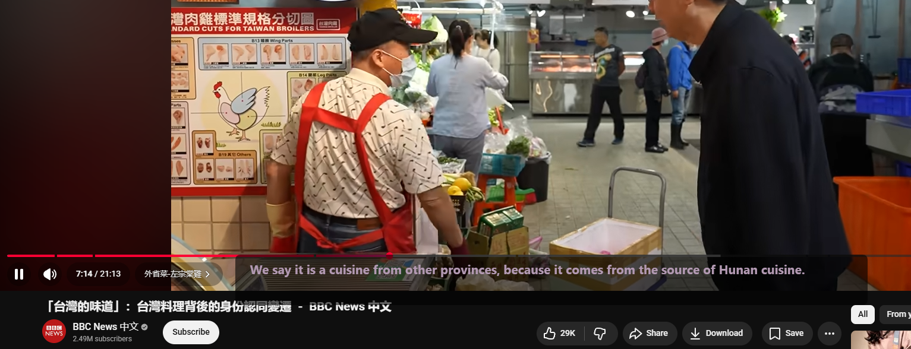
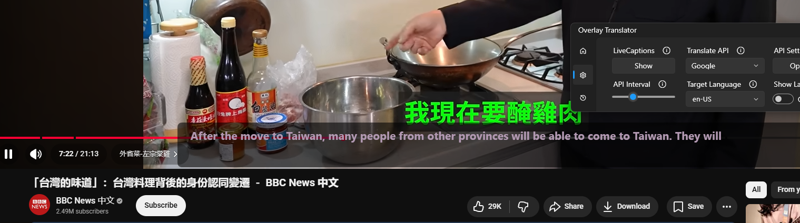
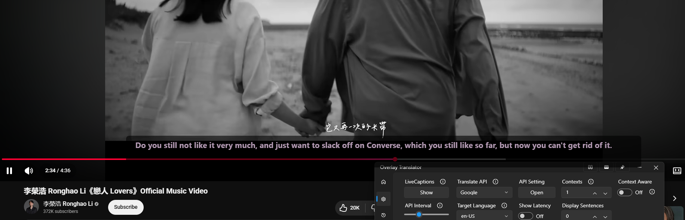

# LiveCaptions Translator (Overlay Translator)

**LiveCaptions Translator** is a sophisticated, real-time desktop application that bridges the gap between system audio and understanding. By harnessing the power of Windows 11's native Live Captions and integrating modern LLMs, it delivers high-accuracy, low-latency translations directly into a customizable, non-intrusive overlay.

---

## 📸 Screenshots

---

## � Download

Get the latest stable release of Overlay Translator here:

> **[🚀 Download Latest Release (April 14 Update)](https://github.com/Bakemono21/OverlayTranslator/releases/tag/updated-translator-april14)**

---

## ✨ Key Features

### 🌍 Intelligent Translation

- **Real-Time Engine:** Instant translation of system audio captured via Windows Live Captions.
- **Context-Aware (LLM):** Utilizes Large Language Models to analyze previous sentences, ensuring nuanced and coherent translations for ongoing dialogue.
- **Versatile API Support:**
  - **LLMs:** OpenAI, Ollama (Local), LMStudio, OpenRouter.
  - **Traditional Engines:** DeepL, Google Translate, Youdao, Baidu, LibreTranslate.
- **Privacy First:** Full support for local inference (Ollama/LMStudio) to keep your data on your own hardware.

### 🎨 Tailored User Experience

- **Customizable Overlay:** Fine-tune font size, colors, stroke weight, and background opacity.
- **Click-Through Mode:** Keeps the translator visible while allowing you to interact with windows behind it.
- **Performance Monitoring:** Optional latency tracking to monitor API response times in real-time.
- **Persistence:** Local SQLite database integration for automatic history logging and review.

---

## 📋 Prerequisites

- **Operating System:** Windows 11 (Version 22H2 or later).
  - _Note for 24H2:_ Source language selection must be handled within the native Windows Live Captions settings.
- **Windows Live Captions:** Must be enabled and configured on your device.

## 🚀 Quick Start Guide

1.  **System Setup:** Ensure Windows Live Captions is active and set to **"Position > Overlaid on screen"**.
2.  **Configuration:**
    - Open the **Setting** page.
    - Choose your provider (e.g., Google for ease of use, or OpenAI/Ollama for accuracy).
    - Input your API keys or local endpoints.
3.  **Activation:** Click **"Show"** in settings to verify Live Captions is running, then **"Hide"** to transfer the caption stream to the Overlay Translator UI.
4.  **Targeting:** Set your target language using BCP 47 tags (e.g., `en`, `zh-CN`, `ja`).

---

## 🛠 Advanced Customization

- **API Interval:** Control the balance between update frequency and token consumption.
- **Context Buffer:** Define how many previous sentences are sent to LLMs for context-aware processing.
- **Custom Prompts:** Edit `setting.json` to redefine the "persona" of the translator (e.g., forcing a more technical or formal tone).

## 📂 Project Structure

- `src/apis/` - Translation service connectors.
- `src/pages/` - UI logic for Settings, History, and Information.
- `src/windows/` - Main application window and the transparent overlay layer.
- `src/models/` - Configuration schemas and data models.
- `setting.json` - Global configuration and API secrets.

---

## 🤝 Contributing

Contributions are welcome! Whether it's reporting a bug, suggesting a feature, or submitting a pull request:

1. Fork the repository.
2. Create your feature branch (`git checkout -b feature/AmazingFeature`).
3. Commit your changes (`git commit -m 'Add some AmazingFeature'`).
4. Push to the branch (`git push origin feature/AmazingFeature`).
5. Open a Pull Request.

## 📄 License

Distributed under the MIT License. See `LICENSE` for more information.

## 🌟 Support

If this project helps you, please consider giving it a star on GitHub!

---

**Maintainer:** @Bakemono021
**Wiki:** Documentation
